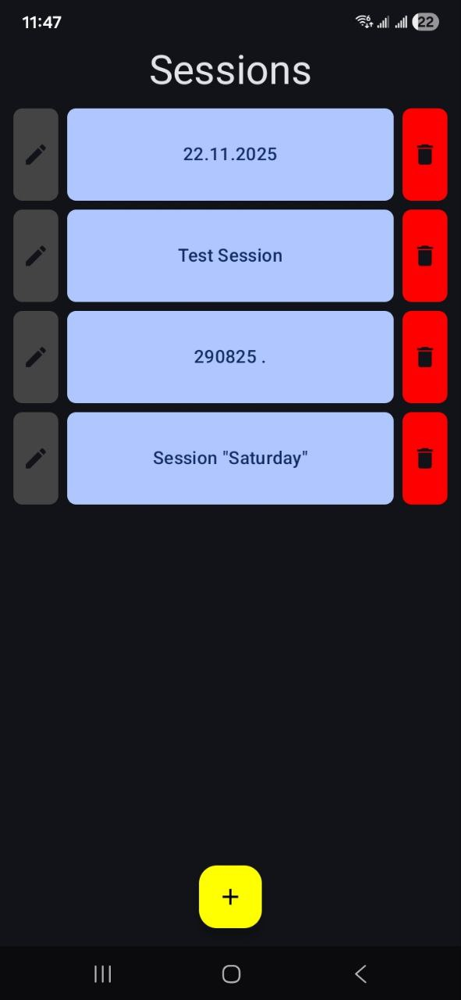
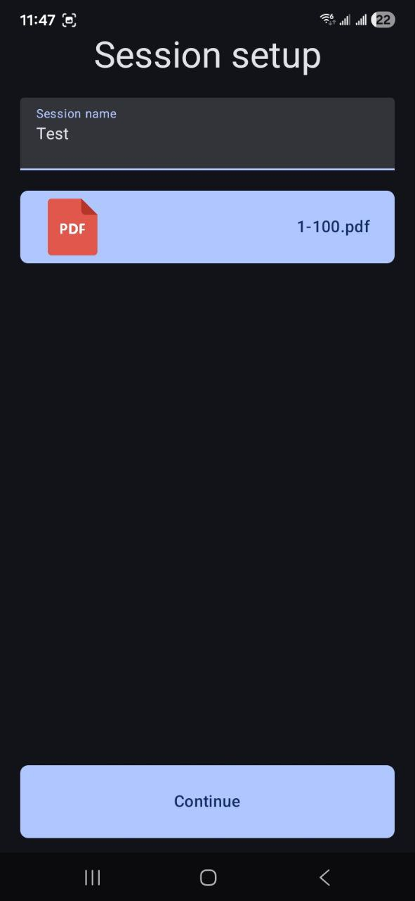
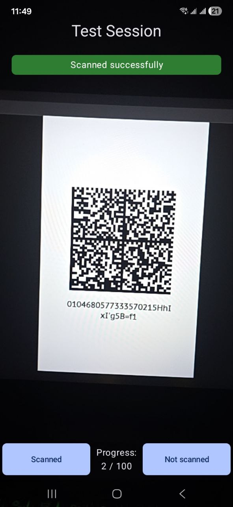

# QR Checker
[](https://github.com/LeonovAndreww/QR-Checker/releases)

Android application for scanning and extracting data from QR codes from camera and multi-page PDF documents.

## Screenshots

<p align="center">
  
  
  
</p>

## Technologies used
[](https://kotlinlang.org/) 
[](https://developer.android.com/jetpack/compose)
[](https://m3.material.io/)
[](https://developer.android.com/training/data-storage/room)
[](https://developer.android.com/training/camerax)
[](https://github.com/journeyapps/zxing-android-embedded)

## Permissions

- **Camera** – required for scanning QR codes using the device camera.
- **Vibrate** – provides haptic feedback for each scan result.

## Privacy

- The app works fully locally - scanned data and history are stored on the device and are NOT sent to any server.
- What is stored:
  - Scan history (scanned text/URLs).
  - Temporary files used for PDF processing.
- How to delete data:
  - Use the in-app option "Delete session".
  - Uninstalling the app will delete all of the app's local data.
- Third-party telemetry:
  - There is no analytics/telemetry enabled.

## Installation
### Option A — Download APK
1. Go to [Releases](https://github.com/LeonovAndreww/QR-Checker/releases).
2. Download and install the latest APK on your device.

### Option B — Build from source
```bash
git clone https://github.com/LeonovAndreww/QR-Checker.git
cd QR-Checker
./gradlew assembleDebug

./gradlew installDebug
```
Or open the project in [Android Studio](https://developer.android.com) and run on an emulator or device.

## Contact
To report issues or request features, use GitHub Issues:
- [Create new issue](https://github.com/LeonovAndreww/QR-Checker/issues)
