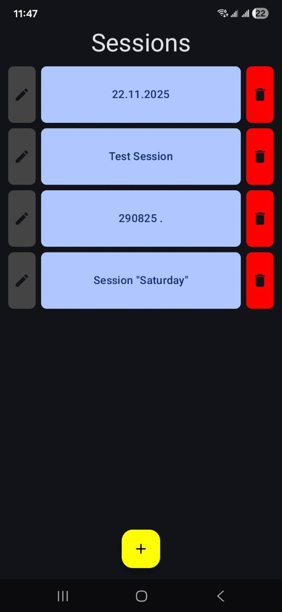
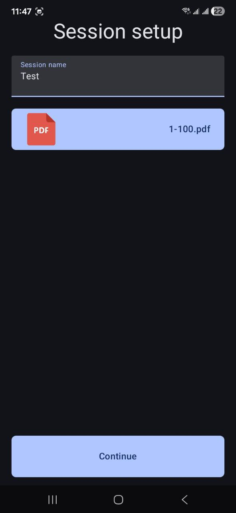
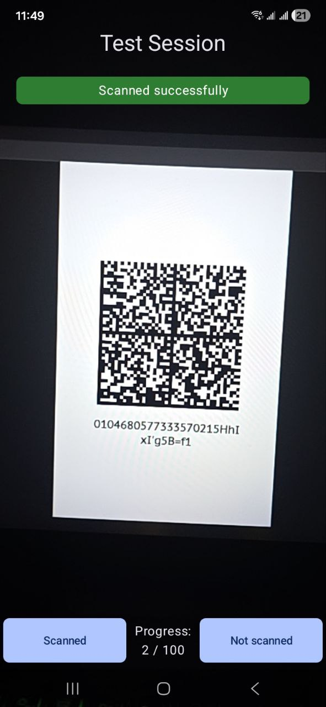

# QR Checker
[](https://github.com/LeonovAndreww/QR-Checker/releases)
[](https://www.android.com/)
[](https://github.com/LeonovAndreww/QR-Checker/stargazers)
[](LICENSE)

Android application for checking a shipment against a list of codes: load the list from a
document, then scan the boxes with the camera and see what is already done and what is
still missing.

## Screenshots

<p align="center">
  
  
  
</p>

## What it does

**A session is a list of codes and the marks on it.**

- Build a session from PDF documents, photos, screenshots and plain text or CSV lists -
  several files at once, mixed. The kind of file is read from its first bytes, so a
  document that arrived from a messenger without a name still works.
- Data Matrix, QR and linear barcodes are all read. A retail label usually carries a
  product barcode next to the Data Matrix, so the symbology of every code is remembered
  and the unneeded kind can be unticked before the session is created.
- Scan with the camera and get an answer for every code: scanned, not in this session, or
  already scanned - with how long ago it was scanned.
- Enter a code by hand when a label is torn: type any part of it and the session is
  searched for a match.
- Two lists, scanned and not scanned, both searchable and sortable by scan time. A code
  can be opened in full, copied with a swipe right and put into the bin with a swipe left.
- The bin lives on the session edit screen, holds removed codes for seven days and keeps
  them out of the lists, the counts and the export.
- Export a list as CSV, or share a whole session as a file: another phone opens it and
  either merges the marks into the session it already has, or keeps it as a second one.
- Back sessions up to a folder of your choice, by hand or automatically. Those files
  survive uninstalling the app.
- Torch and pinch zoom on the scan screen; theme, language, 12/24-hour clock, vibration
  and sound in the settings.

## Technologies used
[](https://kotlinlang.org/) 
[](https://developer.android.com/jetpack/compose)
[](https://m3.material.io/)
[](https://developer.android.com/training/data-storage/room)
[](https://developer.android.com/training/camerax)
[](https://developers.google.com/ml-kit/vision/barcode-scanning)

The barcode model is bundled into the package, so the app does not need Google Play
services to be installed.

## Permissions

- **Camera** - required to scan codes in real time.
- **Vibrate** - provides haptic feedback for each scan result.

The app asks for nothing else. Internet access is explicitly removed from the manifest.

## Privacy

- The app works fully locally - sessions, codes and marks stay on the device and are
  **not** sent to any server.
- What is stored:
  - Sessions: the code lists, which of them are scanned and when.
  - App settings, and the folder picked for backups.
  - Temporary files while a document is being read, and the CSV files you export.
- The session database is left out of Android cloud backup - use the app's own backup to
  a folder instead.
- How to delete data:
  - Delete a session in the app, or empty the bin on its edit screen.
  - Uninstalling the app deletes all of its local data. Files written to your backup
    folder and exported CSVs stay where they are.
- Third-party telemetry:
  - There is no analytics/telemetry enabled.

## Installation
### Option A - Download APK
1. Go to [Releases](https://github.com/LeonovAndreww/QR-Checker/releases).
2. Download the latest 'qr-checker.apk' on your device.
3. Enable "Install from unknown sources" if needed.
4. Install the application.

### Option B - Build from source
```bash
git clone https://github.com/LeonovAndreww/QR-Checker.git
cd QR-Checker
./gradlew assembleDebug

./gradlew installDebug
```
Alternatively, open the project in [Android Studio](https://developer.android.com) and run on an emulator or device.

Release builds are signed from `keystore.properties` next to the project - copy
`keystore.properties.example` and fill it in. Without that file `assembleRelease` still
works and simply leaves the APK unsigned, so a fresh clone builds.

Requires Android 7.0 (API 24) or newer.

## License

Licensed under the [Apache License 2.0](LICENSE). You may use, modify and
redistribute the code, including commercially, as long as the copyright notice and the
license are kept and changed files are marked as changed.

## Contact
Issues and feature requests are tracked via GitHub Issues:
- [Create new issue](https://github.com/LeonovAndreww/QR-Checker/issues)
